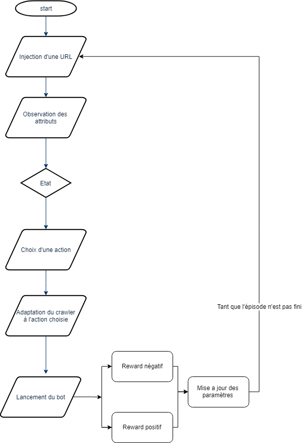
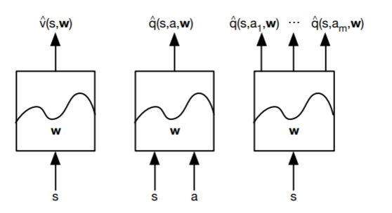

# SMARTBOTJS

Smart crawler using reinforcement learning to avoid detection.

**Sérialisation**

Les éléments à sérialiser sont les Q-values, les paramètres de l'algorithme,
les sites webs et leurs attributs, les états, les actions, l'épisode auxquel nous nous somme
arrêtés.
Nous pouvons stocker tout ceci dans une fichier json.
Les interruptions de programmes dûs aux signaux SIGINT ou SIGQUIT meneront à l'enregistrement
de l'état du programme.

**Fonctions d'approximations dans notre cas**

Pour le moment, nos valeurs sont représentés par des tables de lookup. Cela
cause des problèmes aux niveaux de larges MDPs, comme nous l'avons vu dans
notre cas dès que nous ajoutons quelques attributs de plus, le nombre d'états
explose, et s'ensuit une explosion du nombre de Q-values.

La solution est donc d'approximer ces derniers par une fonction, qui va être
paramétrée par des poids.

Types possibles :

* Lineaires
* Réseaux de neurones
* Arbre de décision
* Nearest Neighbour
* Fourrier/Ondelettes

Les FA vont nous permettre d'avoir une définition plus vague d'un état et ainsi
de pouvoir s'adapter à de nouveaux états.

On doit pouvoir implémenter un algorithme utilisant une fonction d'approximation après
une documentation plus complète.

